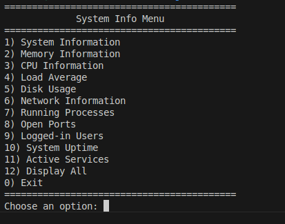

# Sysinfo script


This is a Bash script designed to provide detailed system information in an interactive menu-driven format.

**This project was developed in just a few hours as part of a training exercise over the weekend.**



## Features

- **System Information**: Displays hostname, kernel version, and distribution details.
- **Memory Information**: Shows total, used, and available memory.
- **CPU Information**: Displays CPU model, number of cores, and current usage.
- **Load Average**: Shows the system's load average.
- **Disk Usage**: Displays disk usage for all mounted filesystems.
- **Network Information**: Lists network interfaces and their IP addresses.
- **Running Processes**: Displays the top 5 processes by CPU usage.
- **Open Ports**: Lists all open ports and their states.
- **Logged-in Users**: Shows currently logged-in users.
- **System Uptime**: Displays the system's uptime.
- **Active Services**: Lists all running services.
- **Interactive Menu**: Allows users to select specific information or display all details at once.

## Requirements

- **Bash**: The script is written in Bash and should be run in a Bash shell.
- **Common Linux Utilities**: The script relies on standard Linux utilities like `free`, `lscpu`, `top`, `ps`, `ss`, `who`, `systemctl`, `df`, `ip`, and `uptime`.

## Usage

1. **Make the script executable**:
   ```bash
   chmod +x sysinfo.sh
   ```
2.  **Run the script**:
    ```bash
    ./sysinfo.sh
    ```
    
3. **Follow the menu prompts**:
    - The script will display a menu with options to view specific system information or display all details.
    - Enter the corresponding number for the information you want to view.
    - Press 0 to exit the script.
      
## Contributing

Contributions are welcome! Please open an issue or submit a pull request for any improvements or bug fixes.

## 📝 License

This project is open-source under the MIT License.

